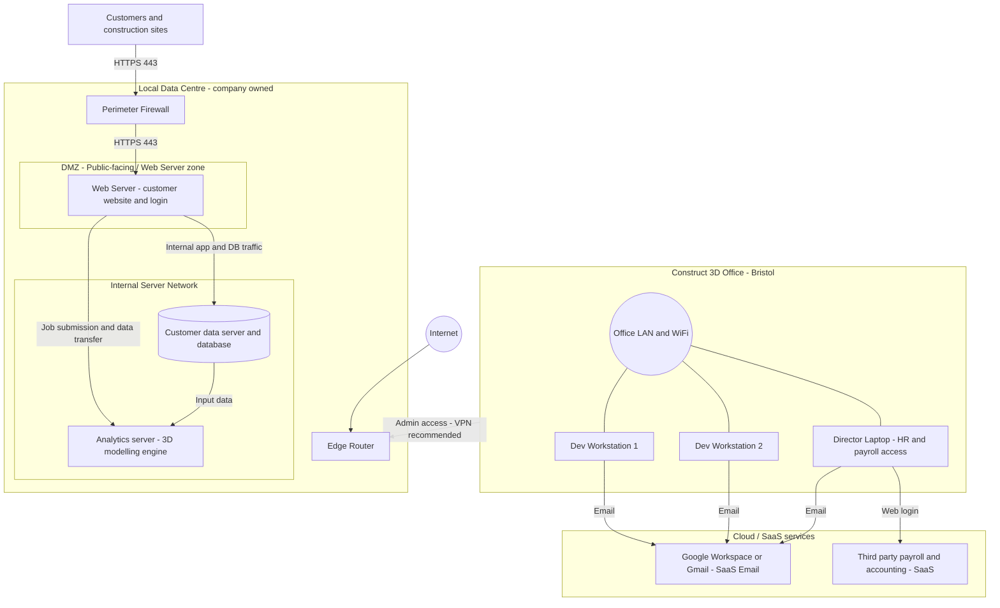

# Scenario A — Network Topology: Review & Guidance

## Overview

This document reviews the **Scenario A topology diagram** for the Construct 3D
network design assignment (iterations 1 and 2), confirms what is correct, and
lists the final tweaks required before the diagram is submission-ready.

---

## Diagram iteration 2 — What is already correct ✅

| Feature | Status | Notes |
|---------|--------|-------|
| **Perimeter Firewall placed between Edge Router and internal zones** | ✅ Correct | The flow Internet → Edge Router → Perimeter Firewall is visible and accurate. |
| **Web Server sits behind the Perimeter Firewall** | ✅ Correct | Only internet-reachable service is the Web Server, matching the Scenario A narrative. |
| **Internal Server Network label present** | ✅ Correct | Customer data server/DB and Analytics Server are grouped inside this zone. |
| **Office LAN (Construct 3D HQ, Bristol) shown as separate subnet** | ✅ Correct | Dev Workstations and Director Laptop all connect via Office LAN/WiFi. |
| **SaaS services labelled in node text** | ✅ Acceptable | "Google Workspace or Gmail – SaaS Email" and "Third party payroll and accounting – SaaS" make the cloud nature clear. |
| **Admin VPN path from HQ to Data Centre** | ✅ Present in iteration 1 | Keep / re-add in iteration 2 (see tweaks below). |

---

## DMZ Web Server Zone — Confirmation

The **DMZ (Demilitarised Zone)** is the correct network segment for the Web
Server.  It sits **inside the Local Data Centre boundary, directly behind the
Perimeter Firewall**, but is deliberately isolated from the Internal Server
Network so that a compromise of the Web Server cannot directly expose the
Customer DB or Analytics Server.

> **Iteration 2 issue:** The Web Server is placed correctly behind the
> firewall, but **the container around it is not yet labelled as the DMZ**.
> Without that label the examiner cannot tell it is an intentional security
> zone.  Add the zone label as described in the tweaks section below.

---

## Final tweaks required (iteration 2 → submission-ready)

### 1 — Add the DMZ container label (critical)

Wrap the **Web Server – customer website and login** box in a named container:

```
DMZ (Public-facing / Web Server zone)
```

*Only* the Web Server should be inside this container.  Keep the Internal
Server Network as a separate, clearly labelled container below it.

### 2 — Fix the floating Analytics Server

In iteration 2 the **Analytics server – 3D modelling engine** node appears
**outside** the Local Data Centre boundary at the top of the canvas.  This is
a mis-placed duplicate.  Delete it and keep the copy that is already inside the
**Internal Server Network** container.

### 3 — Add HTTPS 443 labels on public-facing arrows

Add the label **`HTTPS 443`** to:

| Arrow | Label |
|-------|-------|
| Perimeter Firewall → DMZ (Web Server) | `HTTPS 443` |
| Customers and construction sites → Perimeter Firewall (or Web Server) | `HTTPS 443` |

This makes it explicit that only port 443 is exposed inbound — a key security
requirement in Scenario A.

### 4 — Reconnect the Customer node (positional)

The **Customers and construction sites** node is currently off to the right
with no visible connection label.  Move it so it sits clearly on the
Internet-facing side (e.g., left or top) and draw a labelled arrow:

```
Customers and construction sites --[HTTPS 443]--> Perimeter Firewall / Web Server
```

### 5 — Add a Cloud / SaaS group annotation (optional but recommended)

Draw a dashed rectangle around:

- Google Workspace or Gmail – SaaS Email  
- Third party payroll and accounting – SaaS

Label the group: **`Cloud / SaaS services`**

This satisfies mark-scheme criteria for "identify cloud components".  The
connection arrows from the Office workstations can be labelled **`HTTPS`** or
**`Web login`**.

---

## Corrected Mermaid diagram

The Mermaid code below incorporates all zones, labels, and annotations.  Paste
it into [draw.io](https://app.diagrams.net/) via **Extras → Edit Diagram** (or
the Mermaid import option) to regenerate the diagram cleanly.



---

## Diagram element checklist (before submission)

- [ ] DMZ container is labelled **"DMZ (Public-facing / Web Server zone)"**
- [ ] Web Server is the **only** element inside the DMZ
- [ ] Internal Server Network container holds **Customer DB** and **Analytics Server**
- [ ] Floating duplicate Analytics Server node has been deleted
- [ ] Arrow from Customer node to the Web Server is labelled **HTTPS 443**
- [ ] Arrow from Perimeter Firewall to Web Server is labelled **HTTPS 443**
- [ ] HQ → Data Centre link is labelled **"Admin access – VPN recommended"**
- [ ] Cloud/SaaS group annotation wraps Gmail and Accounting nodes
- [ ] Connection arrows from workstations to SaaS services are labelled **HTTPS** or **Web login**

---

## Quick reference — DMZ explained

| Term | Meaning in this diagram |
|------|------------------------|
| **DMZ** | De-militarised Zone; a network sub-segment between the public internet and the internal private network. Only required ports (HTTPS 443) are exposed inbound. |
| **Perimeter Firewall** | Enforces policy at the boundary; permits inbound HTTPS to the Web Server only; blocks direct inbound access to the Internal Server Network. |
| **Internal Server Network** | Private zone, not reachable directly from the internet; the Web Server requests data from the DB and Analytics Server internally, so the DB never needs a public port. |

---

*Last reviewed: iteration 2 (iterationn2.drawio.png)*
