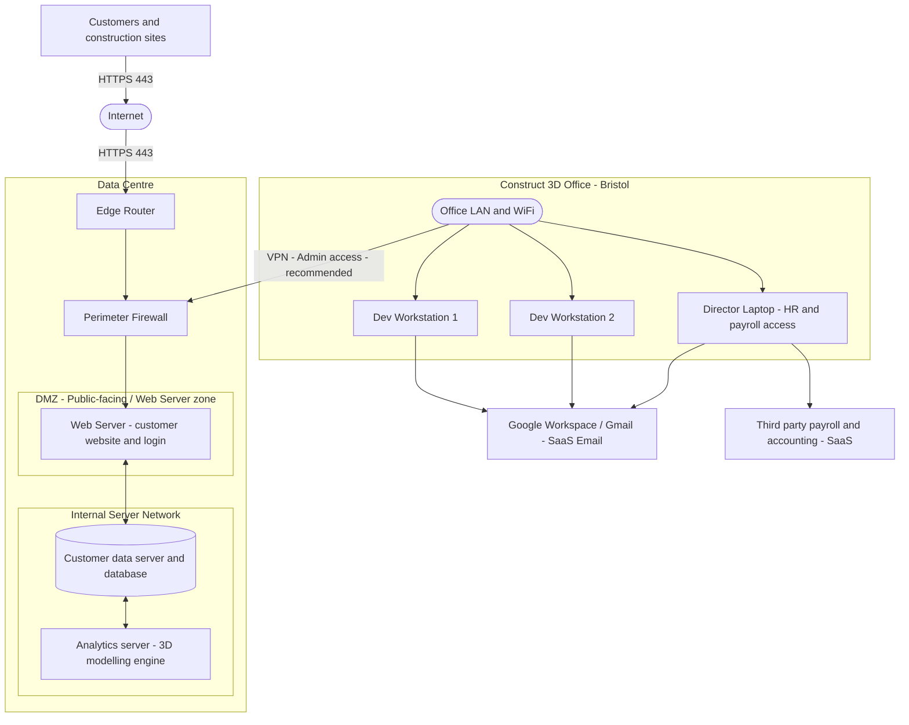

# Scenario A — Authentication and Privilege Security

## Part A1: Network Topology Diagram

### Overview

The diagram below represents the Construct 3D (Bristol) network architecture for Scenario A.
It shows all labelled devices/nodes, network zones, cloud/SaaS components, and — critically for
the A1 rubric — the **VPN (Admin access) recommended** link between the Office LAN/WiFi and
the Perimeter Firewall.

---

### Diagram Reference (user iterations)

The following screenshots show the progression of the topology diagram:

**Iteration 1** — initial layout (zones not yet separated):

**Iteration 2** — DMZ and Internal Server Network clearly separated:

**Iteration 3 (draw.io working file)** — VPN label being added:

---

### Mermaid Diagram Source

The snippet below is the canonical Mermaid source for the Scenario A topology.
It is draw.io-compatible (no `\n` in labels, no `[[ ]]` double-bracket nodes).

---

### Where to Place the VPN Label — and Why

| # | What to do | Why it matters |
|---|-----------|----------------|
| 1 | Draw a connector from **Office LAN and WiFi** to **Perimeter Firewall** | Admin/dev staff manage servers remotely; this is the management path |
| 2 | Label the connector **"VPN (Admin access) – recommended"** | The A1 rubric requires VPN connections to be shown and labelled |
| 3 | Do **not** label the Internet → Edge Router path as VPN | That path carries customer HTTPS traffic, not admin tunnels |
| 4 | The VPN should terminate on the **Perimeter Firewall / VPN Gateway** | This prevents admin ports (SSH/RDP) from being exposed directly to the internet |

In draw.io: right-click the connector → *Edit Connection* → type the label text, or simply double-click the connector arrow and type the label directly.

---

### Figure Caption (paste under the diagram in your report)

> The Web Application is hosted on a dedicated **Web Server in the DMZ (public-facing zone)**, placed behind the Perimeter Firewall and accessible from the Internet **only over HTTPS (TCP 443)**. The **Customer Database** and **Analytics Server** reside on the **Internal Server Network** and are not directly reachable from the Internet; access is limited to required application/data flows from the web tier. Admin/developer access from the Bristol office to the data-centre is routed through a **VPN tunnel terminating on the Perimeter Firewall**, ensuring that management ports are never exposed to the public Internet. This segmentation reduces the blast radius of a public-facing web server compromise and protects sensitive customer data and compute resources.

---

### A1 Checklist

- [x] All devices/nodes labelled (workstations, director laptop, edge router, firewall, web server, DB, analytics, SaaS)
- [x] Network links shown (wired, wireless, Internet boundary)
- [x] **VPN connection explicitly labelled** — Office LAN/WiFi → Perimeter Firewall, labelled "VPN (Admin access) – recommended"
- [x] Cloud/SaaS components identified (Google Workspace/Gmail SaaS, Third-party Payroll/Accounting SaaS)
- [x] DMZ zone clearly delineated (Web Server only)
- [x] Internal Server Network clearly delineated (Customer DB + Analytics Server)
- [x] Internet-facing path labelled with HTTPS 443

---

## Part A2: Executive Summary — Authentication & Privilege Vulnerabilities

*(1 000-word report — draft to be added here or in a separate `A2-executive-summary.md` file)*
