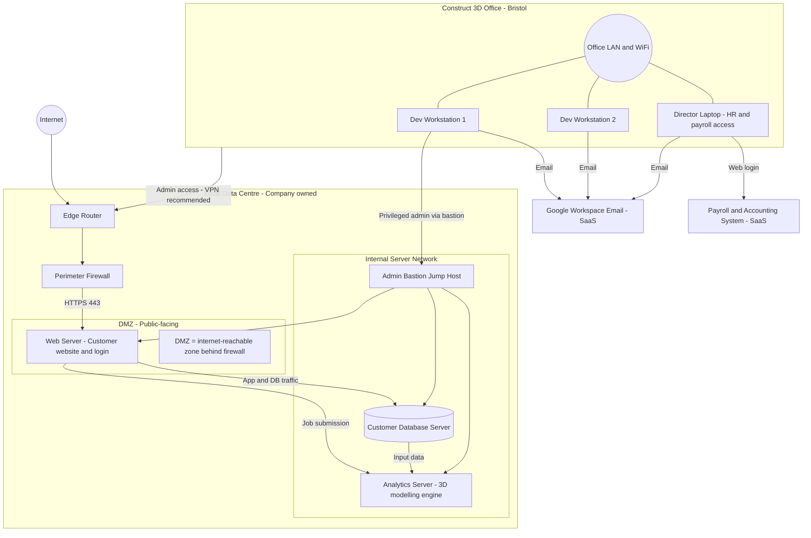

# Scenario A — Authentication and Privilege Security

## Part A1: Network Topology Diagram

The diagram below shows the Construct 3D network architecture.
Paste the Mermaid source into **draw.io → Extras → Edit Diagram** (select Mermaid format),
or use [Mermaid Live Editor](https://mermaid.live).

> **DMZ (Demilitarised Zone)** = the internet-reachable zone sitting *behind* the perimeter
> firewall but *in front of* the internal server network.  Traffic entering from the internet
> is permitted to reach only the Web Server in the DMZ (HTTPS 443); all other internal
> services are shielded by the firewall.  The Web Server then communicates inward to the
> Customer Database and the Analytics Server on the Internal Server Network, meaning
> those systems are never directly exposed to the internet.

### Network Zone Summary

| Zone | Components | Exposure |
|------|-----------|----------|
| **Internet / Cloud** | Internet, Google Workspace Email (SaaS), Payroll SaaS | Public |
| **DMZ (Public-facing)** | Web Server (customer website + login) | Internet-reachable via firewall HTTPS 443 only |
| **Internal Server Network** | Customer Database, Analytics Server, Admin Bastion | Internal only — not directly reachable from internet |
| **Office LAN** | Dev Workstations, Director Laptop, Office WiFi | Internal / outbound only |

### Traffic Flow Description

| Flow | Protocol / Port | Description |
|------|----------------|-------------|
| Internet → Firewall → Web Server | HTTPS 443 | Customer-facing website and login portal |
| Web Server → Customer Database | App/DB | Customer data reads and writes |
| Web Server → Analytics Server | Job submission | 3D modelling job requests |
| Customer Database → Analytics Server | Data transfer | Site/input data feed to modelling engine |
| Office LAN → Admin Bastion | SSH/RDP via VPN | Privileged administrative access to all servers |

---

## Part A2: Executive Summary — Authentication and Privilege Vulnerabilities

*(See full write-up in the assignment submission.)*
