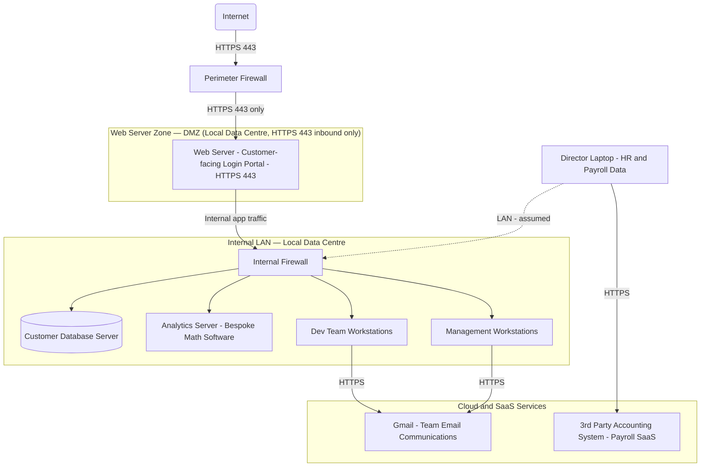

# Scenario A — Construct 3D: Network Topology Diagram

## Overview

Construct 3D hosts its website and customer data on **physical hardware in a local data centre**.
The network is divided into distinct security zones separated by firewalls.

> **Where is the Web Server zone?**
> The Web Server sits in the **DMZ (Demilitarised Zone)** — the public-facing network segment
> inside the local data centre, placed **behind the perimeter firewall** and **in front of the
> internal firewall**. It is the only zone directly reachable from the internet, exclusively on
> **HTTPS port 443**. All other internal systems (customer database, analytics server, dev
> workstations) are isolated from the internet by both the perimeter firewall and the internal
> firewall.

---

## Network Topology Diagram

> **Diagram note:** This diagram is compatible with draw.io Mermaid import.
> Open draw.io → Extras → Edit Diagram → paste the Mermaid block above.

---

## Zone Descriptions

| Zone | Location | Key Devices | Exposed to Internet? |
|------|----------|-------------|----------------------|
| **Web Server Zone (DMZ)** | Local data centre, between perimeter and internal firewalls | Web Server (Customer Login Portal) | **Yes — HTTPS 443 only**, via perimeter firewall rule |
| **Internal LAN** | Local data centre, behind internal firewall | Customer Database, Analytics Server, Dev Workstations, Management Workstations | No — isolated by internal firewall |
| **Cloud / SaaS** | Off-premises, vendor-hosted | Gmail (email), 3rd Party Accounting (payroll) | Accessed outbound by staff over HTTPS; not part of the on-prem network |
| **Director Laptop** | Office / remote | HR & payroll data | Connects outbound to 3rd party accounting SaaS; assumed on internal LAN |

---

## Web Server Zone — DMZ Detail

The **DMZ (Demilitarised Zone)** is a standard network architecture pattern used to expose a
limited set of services to the internet while protecting the rest of the internal network.

For Construct 3D, the DMZ contains the **Web Server** only:

- Hosted on **physical hardware owned by Construct 3D** inside a local data centre.
- Accepts inbound connections from the internet on **TCP port 443 (HTTPS)** only —
  enforced by a **perimeter firewall** rule.
- Provides the **customer-facing login portal** and (in the planned next phase) direct
  customer data uploads.
- Traffic from the web server to back-end systems (customer database, analytics server)
  passes through a second **internal firewall**, which restricts which ports and protocols
  are permitted.

### Key security considerations for the DMZ

1. **Perimeter firewall** must block all inbound ports except 443 (and 80 for HTTP→HTTPS
   redirect if needed). Outbound rules should follow least-privilege.
2. **Internal firewall** must restrict the web server to only the specific database ports and
   application APIs it legitimately needs — no blanket LAN access.
3. Physical access to the data centre is restricted; currently only **one developer** is skilled
   to perform on-site maintenance, creating a single point of failure.
4. The planned customer-upload feature will increase data flow from the DMZ into the internal
   LAN — this must be carefully designed to include input validation and malware scanning
   before data reaches the analytics server.

---

## Network Links Summary

| Link | Protocol / Port | Direction | Notes |
|------|----------------|-----------|-------|
| Internet → Perimeter Firewall | HTTPS 443 | Inbound | Public internet traffic to web server |
| Perimeter Firewall → Web Server (DMZ) | HTTPS 443 | Inbound | Only permitted inbound service |
| Web Server → Internal Firewall | App traffic (HTTPS/custom) | Outbound from DMZ | Controlled by internal firewall rules |
| Internal Firewall → Customer DB | DB protocol (e.g. MySQL 3306) | Internal | Restricted to web server source IP |
| Internal Firewall → Analytics Server | Custom app protocol | Internal | Dev team access for job submission |
| Dev / Management Workstations → Gmail | HTTPS 443 | Outbound | Email communications — Google SaaS |
| Director Laptop → 3rd Party Accounting | HTTPS 443 | Outbound | Payroll SaaS — cloud-hosted |
| Director Laptop → Internal LAN | LAN (assumed wired/Wi-Fi) | Internal | HR data on laptop, not on server |

---

*See the [Part A2 Executive Summary](partA2-executive-summary.md) for authentication and
privilege vulnerability analysis and countermeasures for this topology.*
