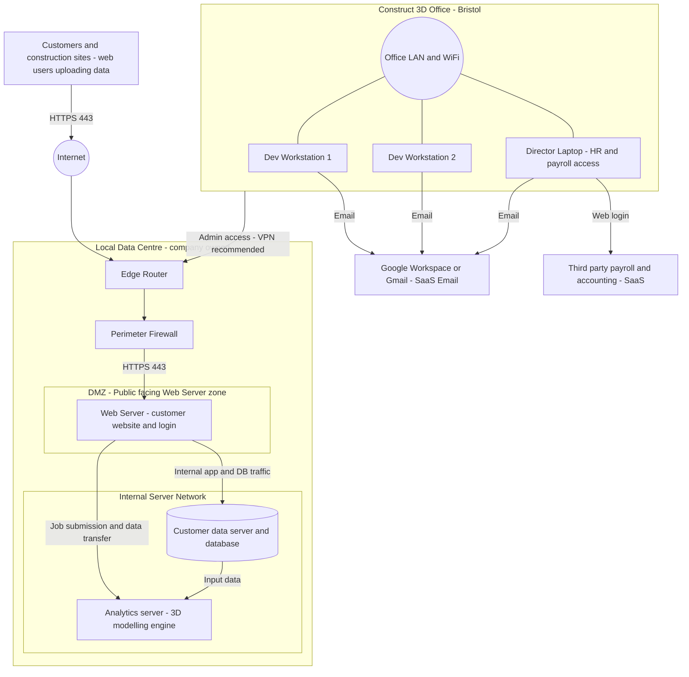

# Scenario A — Network Topology Diagram (Mermaid)

This file contains a draw.io-compatible Mermaid flowchart for the **Scenario A** network topology.

## How to insert into draw.io

1. Open [draw.io](https://app.diagrams.net/) (or the desktop app).
2. Go to **Extras → Edit Diagram** (or **Insert → Advanced → Mermaid**).
3. Copy the entire code block below and paste it into the dialog.
4. Click **OK** / **Insert** — the diagram will render automatically.

> **Tip:** If you see a parse error, ensure you are using the "Mermaid" tab (not "XML") in the Edit Diagram dialog, and that no extra blank lines were added before `flowchart TB`.

---

## Mermaid Code — Scenario A (current / as-is state)

---

## Key design decisions

| Decision | Reason |
|---|---|
| `subgraph DMZ[...]` wraps only the Web Server | Explicitly shows the public-facing zone separated from internal systems |
| `subgraph INT[...]` wraps CustomerDB and AnalysisServer | Explicitly shows the internal/trusted server network |
| `Customers` node on Internet side | Represents construction site users who upload data via the website; traffic flows through Internet and Firewall before reaching the Web Server |
| `Gmail` and `Accounting` nodes outside all subgraphs | Represents externally-hosted SaaS services |
| No `\n` in any label | Required for draw.io Mermaid compatibility |
| No `[[ ]]` node syntax | Avoids parse errors in older Mermaid renderers used by draw.io |
| Parentheses and slashes avoided in labels | Minimises risk of tokeniser errors across Mermaid versions |
