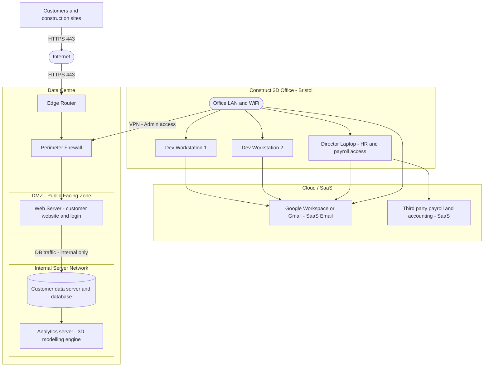

# Scenario A — Part A1: Network Topology

## Overview

This document provides submission-ready guidance, a figure caption, and a draw.io-compatible Mermaid source for the **Scenario A (Authentication and Privilege Security)** network topology diagram.

---

## Network Zones and Components

### DMZ — Public-Facing Zone

The **Web Server (customer website and login)** sits in a dedicated **DMZ** behind the Perimeter Firewall. It is reachable from the Internet via **HTTPS (TCP 443)** only. No other server is directly exposed to the Internet.

### Internal Server Network — Private Zone

The **Customer Data Server / Database** and the **Analytics Server (3D modelling engine)** reside in the **Internal Server Network**. These servers are **not accessible from the Internet**; they can only be reached via the Web Server through tightly controlled internal flows (labelled "DB traffic – internal only" on the diagram).

### Office Network — Bristol HQ

The Bristol office contains:
- **Office LAN and Wi-Fi** hub
- **Dev Workstation 1** and **Dev Workstation 2**
- **Director Laptop** (HR and payroll access)

### VPN — Admin Access Link

A **VPN (Admin access)** connection runs from the **Office LAN and Wi-Fi** to the **Perimeter Firewall**, allowing staff and administrators to manage internal servers remotely without exposing SSH/RDP ports to the public Internet. This link is labelled **"VPN (Admin access) – recommended"** on the diagram and is the sole administrative path into the data-centre network.

### Cloud / SaaS Components

The following external cloud-hosted services are identified on the diagram (annotated as **Cloud/SaaS**):

| Service | Type | Users |
|---------|------|-------|
| **Google Workspace / Gmail** | SaaS – Email & Collaboration | All office staff |
| **Third-party Payroll and Accounting** | SaaS – Finance | Director Laptop |

These services are accessed outbound from the office network and are not hosted on-premises.

---

## Figure Caption (for report)

> **Figure 1 – Scenario A Network Topology.**
> The Web Application is hosted on a dedicated Web Server within the DMZ (Public-Facing Zone), placed behind a Perimeter Firewall and accessible from the Internet via HTTPS (TCP 443) only. The Customer Database and Analytics Server reside in a separate Internal Server Network, reachable solely through the Web Server via internal data flows, ensuring they cannot be directly accessed from the Internet. Administrative access from the Bristol office to the data-centre perimeter is provided through a VPN link (labelled "VPN – Admin access"), while Google Workspace/Gmail and a third-party Payroll/Accounting platform are identified as external Cloud/SaaS services used by office staff.

---

## Mermaid Diagram Source (draw.io-compatible)

Paste the block below into **draw.io → Extras → Edit Diagram → Mermaid** to reproduce the topology.

> **Note:** Labels use plain text (no `\n`, no `[[ ]]`) for full draw.io Mermaid compatibility.

---

## A1 Submission Checklist

- [x] All devices/nodes labelled (workstations, director laptop, edge router, firewall, web server, database, analytics server, SaaS nodes)
- [x] Network links shown clearly: wired/wireless (office LAN/Wi-Fi), internet boundary (HTTPS 443), and **VPN admin access link**
- [x] DMZ (public-facing) and Internal Server Network zones clearly defined and labelled
- [x] Cloud/SaaS components identified and annotated: Google Workspace/Gmail and Payroll/Accounting SaaS
- [x] Figure caption suitable for technical report included above
- [x] Mermaid source compatible with draw.io Mermaid import
