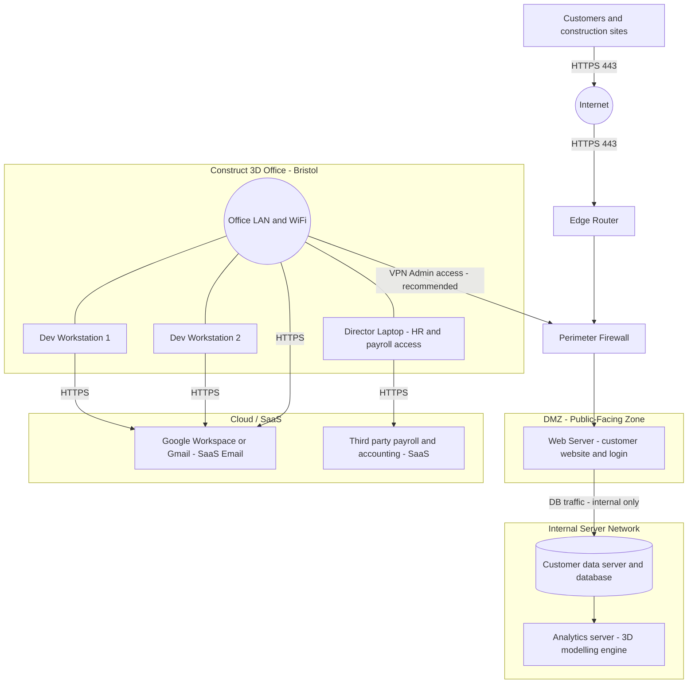

# Scenario A — Network Topology (Part A1)

## A1 Checklist Confirmation

| Requirement | Status | Notes |
|---|---|---|
| Label all devices/nodes (servers, workstations, routers, firewalls, databases) | ✅ | Edge Router, Perimeter Firewall, Web Server, Customer DB, Analytics Server, Dev Workstations, Director Laptop all labelled |
| Show network links clearly (wired, wireless, VPN, internet boundaries) | ✅ | HTTPS 443 on public path; internal DB/analytics links labelled; **VPN (Admin access) recommended** link shown from Office LAN to Perimeter Firewall |
| Identify cloud-based / SaaS components | ✅ | Google Workspace / Gmail (SaaS Email) and Third-party Payroll & Accounting SaaS shown in dedicated Cloud/SaaS zone |
| Separate DMZ (public-facing) zone | ✅ | Web Server isolated in DMZ behind Perimeter Firewall |
| Internal Server Network (not internet-exposed) | ✅ | Customer Database and Analytics Server are internal-only |
| Internet boundary shown | ✅ | Internet node with inbound HTTPS 443 path to Edge Router |

---

## Figure Caption

> The web application is hosted on a dedicated **Web Server in the DMZ (public-facing zone)**, placed behind the Perimeter Firewall and reachable from the Internet **only over HTTPS (TCP 443)**. The **Customer Database** and **Analytics Server** reside on the **Internal Server Network** and are **not directly reachable from the Internet**, with access restricted to required application and data flows from the web tier. This segmentation reduces the blast radius of a compromise of the public-facing web server and helps protect sensitive customer data and compute resources. Administrative access from the Bristol office to the data-centre perimeter is via a **recommended VPN tunnel** terminating at the Perimeter Firewall, avoiding direct exposure of SSH/RDP admin ports to the Internet.

---

## Network Topology Diagram — Mermaid Source (draw.io compatible)

> **Usage:** In draw.io, choose **Extras → Edit Diagram**, select **Mermaid** from the format dropdown, and paste the code below.

---

## Key Design Decisions

| Decision | Rationale |
|---|---|
| Web Server in DMZ | Isolates the public-facing service; a compromise does not give direct access to internal systems |
| Perimeter Firewall as VPN gateway | Admin traffic terminates at the firewall, avoiding exposure of RDP/SSH ports to the Internet |
| Customer DB and Analytics in Internal Network | Sensitive data and compute are never directly reachable from outside |
| SaaS services accessed via HTTPS from Office | No on-premises email or payroll servers required; cloud services accessed over encrypted channels |
| VPN for admin access (recommended) | Admins connecting remotely should use VPN rather than direct internet-exposed admin ports |
