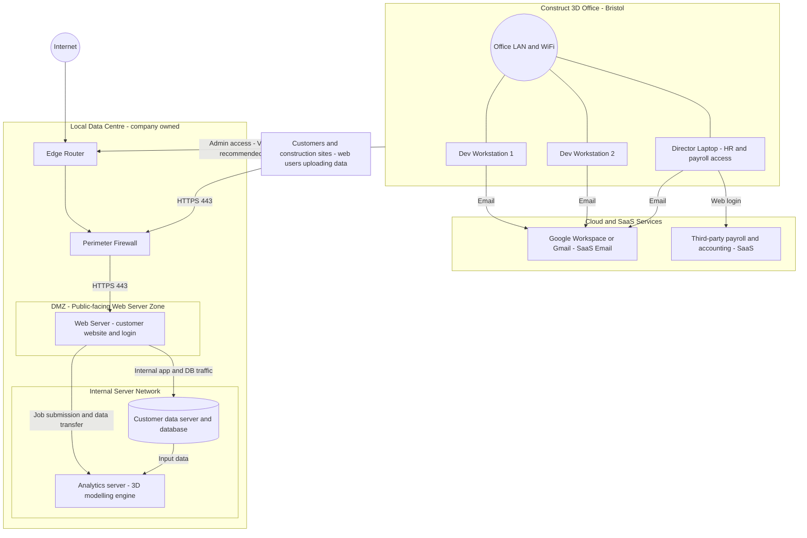

# Scenario A — Network Topology Diagram

## 1. Where is the Web Server Zone?

The **Web Server zone is the DMZ (Demilitarised Zone)**, located inside the Local Data Centre, **directly behind the Perimeter Firewall** and **in front of the Internal Server Network**.

Traffic flow:

```
Internet → Edge Router → Perimeter Firewall → DMZ (Web Server) → Internal Server Network
```

- The DMZ is **internet-reachable** but isolated from the internal network by the firewall.
- Only required ports are open inbound (HTTPS 443).
- The internal servers (Customer DB, Analytics Server) are **never directly exposed** to the internet.

---

## 2. Step-by-Step draw.io Editing Instructions

Use these instructions to update your existing Scenario A diagram in [diagrams.net (draw.io)](https://app.diagrams.net/).

### Step 1 — Add a DMZ container around the Web Server

1. Open your diagram in draw.io.
2. From the toolbar, select **Insert → Container** (or press **C** then drag a rectangle).
3. Draw a rectangle around the existing **"Web Server – customer website and login"** box.
4. Double-click the container border/title area and type:
   `DMZ (Public-facing / Web Server Zone)`
5. Use a **light-orange or light-red fill** on the container to visually distinguish it from the internal zone.
6. Ensure the container sits **below the Perimeter Firewall** and **above the Internal Server Network** box.

### Step 2 — Label the Internal Network container

1. Draw (or resize) a second container around **Customer data server and database** and **Analytics server**.
2. Double-click its title and type:
   `Internal Server Network`
3. Use a **light-blue fill** to contrast with the DMZ.
4. Add a short note inside (right-click → **Edit Tooltip** or use a Text label):
   `No direct internet access. Accessed only via Web Server.`

### Step 3 — Show the Customer node

1. If "Customers and construction sites" is not already on the canvas, add a **Rectangle** shape outside the Data Centre boundary.
2. Label it: `Customers and construction sites (web users uploading data)`
3. Draw an arrow from this node to the **Perimeter Firewall** (or directly to the Web Server if your diagram shows traffic bypassing the edge router for clarity).
4. Label the arrow: `HTTPS 443`

### Step 4 — Show SaaS components

1. Add two rectangle shapes **outside** all boundary boxes (to the right of the diagram).
2. Label them:
   - `Google Workspace / Gmail (SaaS – Email)`
   - `Third-party Payroll and Accounting (SaaS)`
3. Draw arrows from **Office endpoint** nodes (Dev Workstations and Director Laptop) to the Gmail box labelled `Email`.
4. Draw an arrow from **Director Laptop** to the Payroll box labelled `Web login`.
5. Optionally group both SaaS boxes inside a container labelled `Cloud / SaaS Services`.

### Step 5 — Final checks

| Check | Expected result |
|-------|----------------|
| DMZ container visible | Yes — wraps Web Server only |
| Internal Network container visible | Yes — wraps Customer DB and Analytics Server |
| Firewall sits above DMZ | Yes |
| Customer node present with HTTPS 443 label | Yes |
| SaaS boxes outside all boundary containers | Yes |
| Arrows labelled (HTTPS 443, Email, Web login, etc.) | Yes |

---

## 3. Mermaid Diagram — Scenario A Topology (draw.io-compatible)

Paste this block into any Mermaid renderer (GitHub markdown preview, [mermaid.live](https://mermaid.live), or the draw.io Mermaid import) to regenerate the diagram from code.

> **Notes:**
> - No `\n` characters are used inside node labels.
> - No `[[ ]]` double-bracket syntax is used.
> - `[(label)]` is standard Mermaid cylinder notation for databases.



---

## 4. Security Architecture Notes

| Zone | Description | Internet-accessible? |
|------|-------------|----------------------|
| DMZ (Web Server Zone) | Public-facing; behind firewall; HTTPS 443 only | Yes — inbound HTTPS only |
| Internal Server Network | Customer DB and Analytics; no direct internet route | No |
| Office LAN | Dev and director endpoints; outbound to SaaS | Outbound only |
| Cloud/SaaS | Google Workspace, Payroll provider | Yes (external) |

Key point: placing the Web Server in a **DMZ** means that even if the web server is compromised, an attacker still faces the internal firewall before reaching the Customer DB or Analytics Server.
